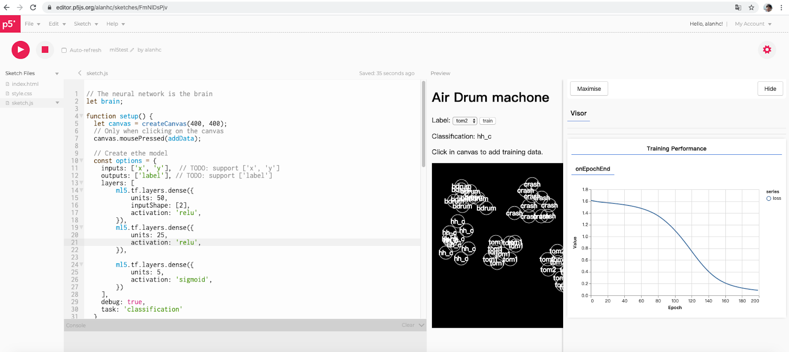
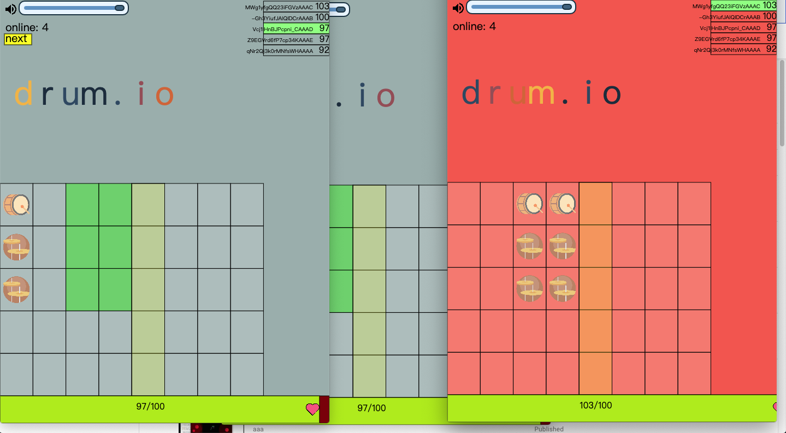
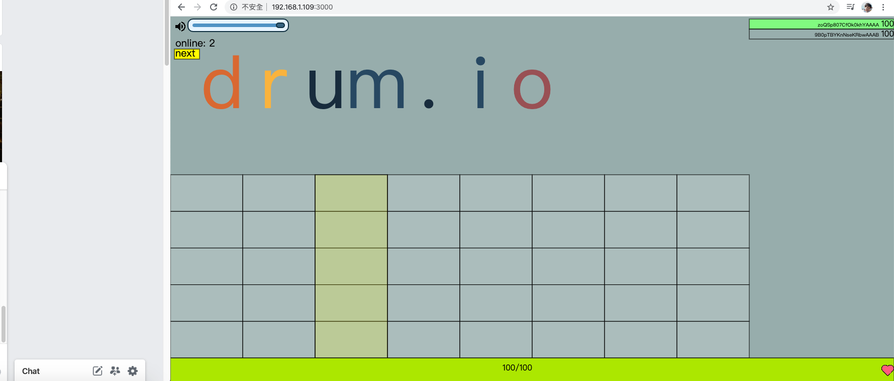

drum.io
=====
此專案的靈感來自[Chrome Music Lab](https://musiclab.chromeexperiments.com/Experiments)、[teachablemachine](https://teachablemachine.withgoogle.com/)及[Agar.io](https://agar.io/?)，為結合一般互動裝置、機器學習及多人連線的對戰遊戲，遊戲狀態分為host與play兩個階段，當某個client在host階段，其他就負責檢查是否有與打一樣，有點像請你跟我這樣做，若client打錯的時候分數會落到host中。
使用到的技術：p5.js、[KNN(ml5.js)演算法](https://ml5js.org/reference/api-KNNClassifier/)、C(Arduino)、及一些其他p5相關library。

## Video
[](https://youtu.be/82d7E0uENcg)

## How to run
1. clone此專案:```git clone https://github.com/alanhc/drum.io.git```
2. 將瀏覽器的自動播放功能打開 設定 進階設定 隱私 音效 允許 {server ip}
3. 參照p5.js serial library 先將整個repository clone下來，npm install，node startServer.js（照著網頁guide做 
4. 將serial.js裡 /dev/ttyACM0 改成您的Arduino 101位址
5. 進資料夾，在小黑下 npm run start（必須有nodejs在電腦上
6. 接上開發版即可開始玩
7. 瀏覽器打開{server ip}:3000即可開始玩

## 遊戲方式
電腦版不接裝置直接照著上方 How to run clone此專案，使用電腦的1~5代表不同的鼓

## 其他資源
serial連線 https://editor.p5js.org/alanhc/sketches/ILrZMsoO7
深度學習訓練 https://editor.p5js.org/alanhc/sketches/FmNlDsPjv     
KNN訓練及測試 https://editor.p5js.org/alanhc/sketches/Zhxob2BQa
介面調整及測試 https://editor.p5js.org/alanhc/sketches/Tpc-lw1Xi

## 螢幕截圖



